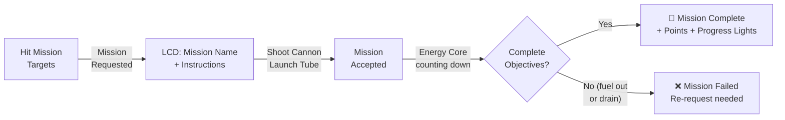
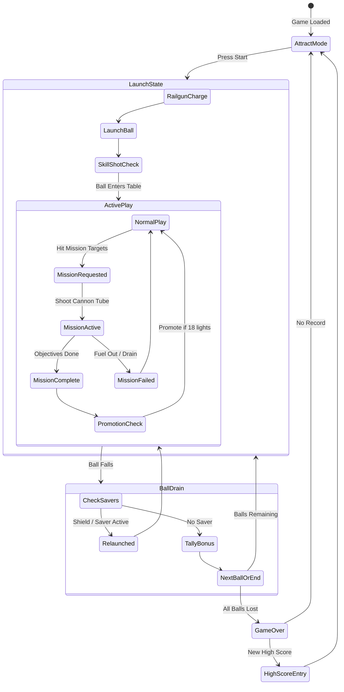

# 🛸 Galactic Recruit Pinball — Game Design Plan

> **Concept**: A browser-playable pinball game themed around Space Invaders, with the exact progression system, mission structure, and table mechanics of *3D Pinball: Space Cadet*.  
> **Delivery**: Single `index.html` file — zero server, zero install.  
> **Rendering**: Modern 3D via Three.js (WebGL) with PBR materials, bloom, reflections.  
> **Input**: Keyboard (flippers, plunger, nudge) + optional touch overlays.

---

## Table of Contents

1. [Tech Stack & Architecture](#1-tech-stack--architecture)
2. [Visual Style & Theme Mapping](#2-visual-style--theme-mapping)
3. [Table Layout](#3-table-layout)
4. [Rank & Mission Progression](#4-rank--mission-progression)
5. [All 17 Missions](#5-all-17-missions)
6. [Scoring System](#6-scoring-system)
7. [Special Modes & Mechanics](#7-special-modes--mechanics)
8. [Light & Flag System](#8-light--flag-system)
9. [Sound & Music](#9-sound--music)
10. [UI / HUD](#10-ui--hud)
11. [Game Flow & State Machine](#11-game-flow--state-machine)
12. [Physics & Flipper Mechanics](#12-physics--flipper-mechanics)
13. [Mobile Mode](#13-mobile-mode-)
14. [Easter Eggs & Cheats](#14-easter-eggs--cheats)
15. [Implementation Phases](#15-implementation-phases)
16. [Resolved Decisions](#16-resolved-decisions)

---

## 1. Tech Stack & Architecture

### Single-HTML Approach

| Layer | Choice | Rationale |
| :--- | :--- | :--- |
| **3D Rendering** | [Three.js](https://threejs.org/) (r170+) | Mature WebGL library, fits in a single `<script>` import via CDN or inline |
| **Physics** | [Cannon-es](https://pmndrs.github.io/cannon-es/) | Full 3D collision detection; physically accurate bumper/flipper interactions; well-maintained |
| **Audio** | Web Audio API — fully procedural synthesis | Zero external files; retro chiptune SFX generated at runtime; perfect for Space Invaders aesthetic |
| **3D Assets** | Hybrid: procedural table geometry + GLB models for aliens/UFOs | Table/flippers/walls are simple primitives; aliens and UFOs get detailed 3D models (base64-inlined in build) |
| **UI/HUD** | HTML/CSS overlay on the `<canvas>` | Dot-matrix LCD text, score display, rank badge |
| **Mobile** | Touch overlay + responsive layout + portrait mode | Virtual flipper zones, plunger swipe gesture, tilt-to-nudge via DeviceMotion API |
| **Build** | Vite dev → single HTML bundle via `vite-plugin-singlefile` | During development we use modules; final output is one `.html` |

> [!NOTE]
> During development, code will be modular (ES modules, separate `.js`/`.ts` files, `.glb` models). The single-HTML constraint applies to the **release build** only. We'll use Vite with `vite-plugin-singlefile` to inline everything.

### Recommended Architecture

```
src/
├── index.html              # Entry point (responsive viewport meta)
├── main.ts                 # Boot, game loop, state machine
├── physics/
│   ├── world.ts            # Cannon-es world setup, inclined plane
│   ├── ball.ts             # Ball body, damping, velocity clamping
│   ├── flipper.ts          # Hinge constraint, angular motor
│   ├── bumper.ts           # Contact impulse on collision
│   └── colliders.ts        # Wall bodies, ramp bodies, drain sensors
├── table/
│   ├── layout.ts           # All table geometry positions + dimensions
│   ├── elements.ts         # Bumpers, targets, ramps, holes, lanes
│   └── lights.ts           # TLight / TLightGroup equivalent
├── game/
│   ├── control.ts          # Mission state machine (mirrors control.cpp)
│   ├── missions.ts         # All 17 mission definitions
│   ├── scoring.ts          # Score calculation, multipliers, bonuses
│   ├── ranks.ts            # 9 ranks + promotion logic
│   └── state.ts            # Game state (ball count, tilt, etc.)
├── rendering/
│   ├── scene.ts            # Three.js scene setup, camera, lighting
│   ├── camera.ts           # Dual-mode camera (fixed / follow-ball toggle)
│   ├── materials.ts        # PBR materials, glow, neon
│   ├── models.ts           # Hybrid: procedural table + GLB loader for aliens
│   └── effects.ts          # Bloom, screen shake, particle FX
├── audio/
│   ├── engine.ts           # Web Audio context, mixer, master volume
│   └── synth.ts            # Procedural SFX + chiptune music generator
├── input/
│   ├── keyboard.ts         # Desktop keyboard bindings
│   ├── touch.ts            # Mobile touch zones (flippers, plunger, nudge)
│   └── motion.ts           # DeviceMotion API for tilt-to-nudge
├── ui/
│   ├── hud.ts              # Score, ball count, LCD ticker
│   ├── menus.ts            # Attract mode, game over, high scores
│   └── responsive.ts       # Layout manager: landscape/portrait, resize
└── utils/
    └── constants.ts        # Tuning values, physics params, breakpoints
```

---

## 2. Visual Style & Theme Mapping

### Theme Translation: Space Cadet → Galactic Recruit

The original Space Cadet uses a NASA/military sci-fi theme. We re-skin everything into the **Space Invaders** universe — pixel-alien iconography meets modern 3D rendering.

| Space Cadet Element | Galactic Recruit Re-theme |
| :--- | :--- |
| NASA Space Shuttle / Rocket motifs | Retro pixel cannon / defense turret |
| Military rank badges | Space Invaders rank icons (progressively larger/rarer alien types) |
| Star field background | Scrolling invasion formation background |
| Blue/purple table color scheme | **Black table surface** with **neon green grid lines**, pink/cyan accents |
| Bumper graphics (planets, stars) | Classic Space Invaders aliens (squid, crab, octopus) as bumpers |
| Ramp habitrails | **Laser beam rails** (glowing neon tubes) |
| Wormholes (sink holes) | **UFO Abduction Beams** — circular vortex with spinning UFO above |
| Gravity Well | **Mothership Tractor Beam** — large UFO in center |
| Launch Ramp | **Cannon Launch Tube** — barrel-shaped with muzzle flash |
| Flag Spinners | **Rotating Alien Discs** — spinning pixel aliens |
| Kickback | **Shield Generator** — energy barrier in left outlane |
| Center Post | **Barrier Drone** — small drone that pops up between flippers |
| Fuel Chute | **Energy Core Charger** — vertical power cell column |
| Plunger | **Railgun Charger** — electromagnetic launch rail |

### 3D Rendering Style

- **Table**: Glossy black playfield with etched neon-green grid pattern (homage to arcade CRT phosphor lines)
- **Bumpers**: 3D sculpted Space Invader aliens that animate on hit (flash, shake, briefly explode into pixels)
- **Flipper bats**: Sleek gunmetal with cyan edge-glow
- **Ball**: Chrome sphere with environment reflections — or optionally a glowing green "plasma ball"
- **Lighting**: Strong overhead spots + colored point lights at every interactive element; bloom post-processing
- **Camera**: **Player-togglable** (press `C` or tap camera icon) between two modes:
  - *Classic fixed*: Slightly tilted top-down matching Space Cadet's view, subtle parallax on nudge
  - *Follow-ball*: Camera gently tracks ball position with smooth damping, slight zoom on fast shots

---

## 3. Table Layout

The layout mirrors Space Cadet's topology exactly, re-skinned.

```
┌─────────────────────────────────────────────┐
│  ┌─ ENERGY CORE ─┐   ┌─ RE-ENTRY LANES ─┐  │
│  │  CHARGER       │   │  ◇  ◇  ◇         │  │
│  │  (Fuel Chute)  │   │  (3 top rollover) │  │
│  └────────────────┘   └───────────────────┘  │
│                                               │
│  ╔═ CANNON ═╗    ┌──────────┐   👾 👾 👾     │
│  ║ LAUNCH   ║    │ MEDAL    │   ATTACK       │
│  ║ TUBE     ║    │ TARGETS  │   BUMPERS (3)  │
│  ║ (Ramp)   ║    └──────────┘   (Alien heads) │
│  ╚══════════╝                                 │
│                                               │
│  ┌─ BOOSTER ─┐     ⬟ MOTHERSHIP ⬟           │
│  │ TARGETS   │     (Gravity Well)             │
│  │ (3 drops) │                                │
│  └───────────┘   ┌── MISSION ──┐              │
│                  │  TARGETS    │  🛸 UFO      │
│  🌀 UFO BEAM 1  │  (3 spot)   │  BEAM 2      │
│  (Wormhole Y)   └─────────────┘  (Wormhole R) │
│                                               │
│  ⟐ ALIEN DISC   ┌─ HAZARDS ─┐  ⟐ ALIEN DISC │
│  (Spinner L)     │  L  │  R  │  (Spinner R)   │
│                  └────┘└─────┘               │
│  🛸 UFO BEAM 3   ┌── SPACE ──┐               │
│  (Wormhole G)    │   WARP    │               │
│                  │ ROLLOVER  │               │
│                  └───────────┘               │
│                                               │
│  ⚡ SHIELD     ┌─────┐ ┌─────┐   OUTLANE R   │
│  GEN (Kickback)│SLING│ │SLING│               │
│  (L outlane)   │  L  │ │  R  │               │
│                └─────┘ └─────┘               │
│         ╔═══╗  ┌── ⬡ ──┐  ╔═══╗             │
│         ║ L ║  │BARRIER│  ║ R ║   FLIPPERS   │
│         ║FLP║  │ DRONE │  ║FLP║              │
│         ╚═══╝  └───────┘  ╚═══╝             │
│                                               │
│              ┌─────────────┐                 │
│              │  DRAIN      │     ▓▓▓▓▓▓▓▓   │
│              └─────────────┘     RAILGUN     │
│                                  (Plunger)   │
└─────────────────────────────────────────────┘
```

> [!IMPORTANT]
> The third flipper (upper-left in Space Cadet, used for Launch Ramp shots) is preserved. In our theme it's a **secondary cannon flipper** mounted near the Cannon Launch Tube.

---

## 4. Rank & Mission Progression

### The 9 Ranks

Ranks are re-themed from military to Space Invaders **Defender Corps** ranks. Each rank is visually represented by the alien/ship the player has "defeated" or "earned."

| # | Space Cadet Rank | Galactic Recruit Rank | Visual Icon |
| :---: | :--- | :--- | :--- |
| 1 | Cadet | **Rookie Defender** | Single small squid alien |
| 2 | Ensign | **Grid Gunner** | Two squid aliens |
| 3 | Lieutenant | **Crab Hunter** | Crab alien |
| 4 | Captain | **Wave Captain** | Crab alien with shield |
| 5 | Lt. Commander | **Octopus Slayer** | Octopus alien |
| 6 | Commander | **Fleet Commander** | Octopus alien with crown |
| 7 | Commodore | **UFO Tracker** | Small UFO |
| 8 | Admiral | **Mothership Hunter** | Large UFO |
| 9 | Fleet Admiral | **Galactic Admiral** | Golden mothership with star |

### Promotion Mechanics (Identical to Space Cadet)

- **18 Progress Lights** arranged in a ring around the Rank Insignia at center-table
- Completing missions awards 6–18 Progress Lights
- When all 18 are lit → **Promotion** → fanfare plays, rank advances, lights reset
- Higher ranks unlock harder mission tiers

### Mission Lifecycle (Identical to Space Cadet)



---

## 5. All 17 Missions

Every mission mirrors Space Cadet exactly, with re-themed names and flavor text.

### Tier 1: Rookie Defender Missions

| # | Space Cadet Name | Galactic Recruit Name | Objective | Reward |
| :---: | :--- | :--- | :--- | :--- |
| 1 | Launch Training | **Cannon Calibration** | Shoot the ball up the Cannon Launch Tube 3 times | 500K pts + 6 Progress Lights |
| 2 | Re-entry Training | **Atmospheric Scan** | Pass through any Re-entry Lane 3 times | 500K pts + 6 Progress Lights |
| 3 | Target Practice | **Alien Target Drill** | Hit the Attack Bumpers (alien heads) 8 times | 500K pts + 6 Progress Lights |
| 4 | Science Mission | **Invasion Recon** | Hit any 9 Drop Targets across the table | 750K pts + 9 Progress Lights |

### Tier 2: Grid Gunner & Crab Hunter Missions

| # | Space Cadet Name | Galactic Recruit Name | Objective | Reward |
| :---: | :--- | :--- | :--- | :--- |
| 5 | Bug Hunt | **Swarm Extermination** | Hit 15 targets (drop + spot combined) | 750K pts + 7 Progress Lights |
| 6 | Rescue Mission | **Civilian Evac** | Upgrade Booster Targets, then enter UFO Beam (Hyperspace) | 750K pts + 7 Progress Lights |
| 7 | Alien Menace | **Crab Wave Assault** | Upgrade Attack Bumpers via Re-entry lanes, then hit bumpers 8–12× | 750K pts + 7 Progress Lights |
| 8 | Secret Mission | **Classified Op** | Enter UFO Beams in exact sequence: **Yellow → Red → Green** | 1.5M pts + 10 Progress Lights |

### Tier 3: Wave Captain & Octopus Slayer Missions

| # | Space Cadet Name | Galactic Recruit Name | Objective | Reward |
| :---: | :--- | :--- | :--- | :--- |
| 9 | Stray Comet | **Rogue Asteroid** | Light all 3 Right Hazard Targets, then enter UFO Beam | 1M pts + 7 Progress Lights |
| 10 | Space Radiation | **Ion Storm** | Light all 3 Left Hazard Targets, then enter any Wormhole | 1M pts + 7 Progress Lights |
| 11 | Black Hole | **Gravity Anomaly** | Upgrade the Slingshots, then enter the Mothership Tractor Beam | 1M pts + 7 Progress Lights |
| 12 | Cosmic Plague | **Signal Jam** | Spin Alien Discs 75 times, then hit the Space Warp Rollover | 1.75M pts + 9 Progress Lights |

### Tier 4: Fleet Commander & UFO Tracker Missions

| # | Space Cadet Name | Galactic Recruit Name | Objective | Reward |
| :---: | :--- | :--- | :--- | :--- |
| 13 | Satellite Retrieval | **Probe Recovery** | Hit the topmost Attack Bumper 3 times | 1.25M pts + 7 Progress Lights |
| 14 | Recon | **Deep Space Patrol** | Pass through any rollover lanes 15 times | 1.25M pts + 7 Progress Lights |
| 15 | Doomsday Machine | **Doomsday Cannon** | Send ball through Outlanes 3 times (shields armed) | 1.25M pts + 7 Progress Lights |
| 16 | Time Warp | **Chrono Rift** | Hit Slingshots 25 times, then shoot Launch Tube or UFO Beam | 2M pts + 10 Progress Lights |

### Tier 5: Grand Finale (Mothership Hunter & Galactic Admiral)

| # | Space Cadet Name | Galactic Recruit Name | Objective | Reward |
| :---: | :--- | :--- | :--- | :--- |
| 17 | Maelstrom | **Final Invasion** | Multi-phase master challenge: 1) Hit 3 Drops 2) Hit 3 Spots 3) Pass 5 Lanes 4) Shoot Energy Core 5) Shoot Cannon Tube 6) Spin Disc 7) Enter UFO Beam 8) Enter Mothership | **5M pts + 18 Progress Lights** (instant full promotion) + all lights celebration |

---

## 6. Scoring System

### Base Element Scoring

| Element | Points |
| :--- | :--- |
| Rollover lanes / Spot targets | 1,000 – 5,000 |
| Attack Bumpers (Level 1 / 2 / 3) | 500 / 1,500 / 4,000 |
| Slingshots | 500 |
| Drop Target bank clear | 50,000 – 100,000 |
| Ramp shots / UFO Beams | 10,000 – 50,000 |
| Alien Disc spins (normal / boosted) | 100 / 1,000 per spin |

### Skill Shot (Railgun Launch)

| Light Position | Points |
| :---: | :---: |
| 1st (lowest) | 15,000 |
| 2nd | 30,000 |
| 3rd (sweet spot) | **75,000** |
| 4th | 30,000 |
| 5th | 15,000 |
| 6th (top exit) | 5,000 |

### UFO Beam (Hyperspace) Progressive Rewards

| Consecutive Hit | Reward |
| :---: | :--- |
| 1st | 10,000 pts |
| 2nd | Progress lights / multiplier |
| 3rd | **Barrier Drone** deployed (center post) |
| 4th | **Extra Ball** lit |
| 5th | **Mothership Tractor Beam** activated |

### Field Multiplier Progression

**1× → 2× → 3× → 5× → 10×** — earned via Medal Targets, Re-entry lane cycles, and UFO Beam hits.

### End-of-Ball Bonus

```
Total Bonus = (Missions × B_mission + Medals × B_medal + Fuel × B_fuel + Rank × B_rank) × Multiplier
```

> [!CAUTION]
> Bonus is **completely forfeited** if the table is tilted!

---

## 7. Special Modes & Mechanics

| Mode | Trigger | Behavior |
| :--- | :--- | :--- |
| **Skill Shot** | Initial plunger launch | Hit the optimal rollover light for max points |
| **Ball Saver** | Ball drains within ~5–10 sec of launch | Ball returned to plunger, no penalty |
| **Shield Generator** (Kickback) | Armed via gameplay | Catches ball draining down left outlane, fires it back |
| **Barrier Drone** (Center Post) | 3 UFO Beam entries | Pops up between flippers, blocks center drain; lowers after one save |
| **Mothership Tractor Beam** (Gravity Well) | 5th UFO Beam entry | Center magnetic trap activates — attracts ball, captures, ejects at random angle |
| **Extra Ball** | 4th UFO Beam entry or score milestone | Additional ball awarded |
| **Tilt System** | Excessive nudging | Warning 1 → Warning 2 → **TILT!** (flippers die, bonus forfeited, ball drains) |

---

## 8. Light & Flag System

| Light Group | Function |
| :--- | :--- |
| **18-Segment Progress Ring** | Tracks mission completion toward next rank promotion |
| **Rank Insignia Badge** | Center display — current rank alien/ship icon |
| **Energy Core Ladder** | 6–8 vertical lights — live mission fuel countdown |
| **Attack Bumper Lamps** | Color-shift: Blue → Green → Red (power level) |
| **Rollover Lane Lights** | Top + return lanes; **flipper buttons rotate lit lanes L/R** for completion strategy |
| **UFO Beam Progress** | 5 lights tracking consecutive shots toward Tractor Beam activation |
| **Shield & Extra Ball Lights** | Outlane indicators for active ball-saving |
| **Booster Flag Indicators** | Shows if Alien Disc spinners are at base or 10× boosted value |

---

## 9. Sound & Music

### Approach: Procedural Web Audio Synthesis

All sounds generated at runtime using the Web Audio API — no external audio files needed for single-HTML delivery.

| Event | Sound Design |
| :--- | :--- |
| **Background Music** | Chiptune 8-bit loop (Space Invaders–style descending 4-note bass pattern, layered with arpeggiated synths) |
| **Flipper** | Sharp solenoid clack (noise burst + low sine) |
| **Bumper Hit** | Classic arcade "boop" with pitch rising per bumper level |
| **Plunger** | Electromagnetic charge-up whine → snap release |
| **Skill Shot** | Ascending chime cascade |
| **Ramp / Tube** | Sci-fi whoosh (filtered noise sweep) |
| **UFO Beam Capture** | Descending warble (theremin-style) + suction |
| **Tractor Beam** | Deep pulsing hum + vortex effect |
| **Alien Disc Spin** | Rapid flutter / whirring |
| **Mission Requested** | Alert chime (two-tone) |
| **Mission Accepted** | Energetic fanfare (8-bit) |
| **Mission Complete** | Victory jingle (Space Invaders death sound reversed + triumph) |
| **Promotion** | Grand fanfare — layered chords ascending |
| **Low Fuel** | Urgent beeping (accelerating tempo) |
| **Tilt Warning** | Warning buzz |
| **TILT!** | Power-down descending tone |
| **Drain** | Descending tone (life lost) |
| **Game Over** | Classic Space Invaders game-over melody |

---

## 10. UI / HUD

Rendered as an HTML/CSS overlay on the Three.js canvas.

```
┌────────────────────────────────────────────────┐
│  SCORE: 1,250,000          BALL: 2  +1 EXTRA   │
│  ┌──────────────────────────────────────────┐   │
│  │ ▓▓ MISSION: SWARM EXTERMINATION         │   │
│  │ ▓▓ HIT 15 TARGETS — 12/15 COMPLETE      │   │
│  └──────────────────────────────────────────┘   │
│                                                  │
│  RANK: ★ CRAB HUNTER ★     HIGH: 3,500,000     │
│  [📷 Camera]  [🔊 Sound]                        │
└────────────────────────────────────────────────┘
```

| Element | Description |
| :--- | :--- |
| **Score Display** | Large 7-segment / pixel-font style, top-left |
| **Ball Counter** | "BALL 1/2/3" + extra ball indicators |
| **Scrolling LCD Ticker** | Dot-matrix style single-line display for game messages |
| **Rank Badge** | Current rank icon + name |
| **High Score** | Persistent top score (localStorage) |
| **Camera Toggle** | Switch between fixed and follow-ball camera (`C` key or tap icon) |
| **Sound Toggle** | Mute/unmute audio |
| **High Score Hall of Fame** | Top 5 records: name, score, rank achieved |

---

## 11. Game Flow & State Machine



---

## 12. Physics & Flipper Mechanics

### Core Physics Model

- **2.5D Inclined Plane**: Table modeled as a tilted surface; gravity vector pulls ball downward
- **Continuous Collision Detection**: Against line segments, circular posts, arc boundaries — prevents tunneling
- **Restitution + Friction**: Per-element bounce coefficients for realistic ball behavior
- **Velocity Clamping**: Max speed cap to prevent physics errors

### Flipper Model

- **Arc Rotation**: Rest angle → max stroke (~45°–50°) with fast angular acceleration
- **Tip Velocity Transfer**: `v_tangential = ω × r` — shots from the flipper tip are fastest
- **Return Spring**: Damped downward recovery when released
- **Cradling**: Ball can rest on a held-up flipper (dead catch technique)

### Bumper & Active Elements

- On collision, apply instantaneous velocity impulse normal to the contact surface
- Slingshots (triangular kickers above flippers) deflect + kick upfield

### Nudge / Tilt

- Left/Right/Up nudge applies small positional offset + velocity to the ball
- Internal tilt accumulator: 3 infractions → TILT

---

## 13. Mobile Mode 📱

The game automatically detects mobile/tablet via `'ontouchstart' in window` and viewport width, switching to a touch-optimized layout.

### Layout: Portrait Mode (Primary)

On mobile, the table runs in **portrait orientation** — natural for a pinball table's vertical aspect ratio. The HUD collapses to a compact top bar.

```
┌──────────────────────────┐
│ SCORE: 1,250,000  BALL:2 │  ← Compact HUD bar
│ ▓▓ SWARM EXTERMINATION   │  ← LCD ticker (single line)
├──────────────────────────┤
│                          │
│                          │
│      PINBALL TABLE       │  ← Full-width 3D canvas
│      (touch zones        │     (scales to fit)
│       overlaid)          │
│                          │
│                          │
│                          │
├──────┬────────┬──────────┤
│  L   │PLUNGER │    R     │  ← Touch zone bar
│FLIP  │ SWIPE  │  FLIP    │
└──────┴────────┴──────────┘
```

### Touch Controls

| Gesture | Action | Zone |
| :--- | :--- | :--- |
| **Tap left side** | Left flipper | Left 35% of screen, bottom half |
| **Tap right side** | Right flipper | Right 35% of screen, bottom half |
| **Swipe up (center bottom)** | Plunger launch — swipe distance = launch power | Center 30%, bottom quarter |
| **Hold + release (center bottom)** | Alternative plunger — hold duration = power | Same zone as swipe |
| **Shake phone left/right** | Nudge table (via `DeviceMotionEvent`) | Whole device |
| **Shake phone forward** | Upward nudge | Whole device |
| **Tap upper-left flipper zone** | Upper-left (3rd) flipper | Upper-left 20% of canvas |
| **Tap camera icon** | Toggle fixed/follow camera | HUD button |
| **Tap sound icon** | Toggle audio | HUD button |

### DeviceMotion Nudge (Tilt-to-Nudge)

```typescript
// Conceptual — reads accelerometer for physical nudge input
window.addEventListener('devicemotion', (e) => {
  const ax = e.accelerationIncludingGravity?.x ?? 0;
  const ay = e.accelerationIncludingGravity?.y ?? 0;
  if (Math.abs(ax) > NUDGE_THRESHOLD) nudge('horizontal', ax);
  if (ay > NUDGE_THRESHOLD_UP) nudge('up', ay);
});
```

> [!NOTE]
> iOS requires user permission for DeviceMotion via `DeviceMotionEvent.requestPermission()`. We'll prompt on first game start with a "Enable tilt controls?" dialog. Falls back to on-screen nudge buttons if denied.

### Responsive Scaling

- **Canvas resolution**: Matches device pixel ratio (`window.devicePixelRatio`) for crisp rendering on Retina/HiDPI screens
- **Table fit**: Scales table to fill width in portrait, or fills height in landscape, maintaining aspect ratio
- **HUD scaling**: Font sizes and button targets scale with viewport — minimum 44px touch targets per Apple HIG
- **Landscape fallback**: If player rotates to landscape, table fills height with HUD on the side (like desktop)

### Performance Targets (Mobile)

| Device Tier | Target FPS | Strategy |
| :--- | :--- | :--- |
| Modern flagship (2023+) | 60 FPS | Full effects: bloom, particles, PBR, shadows |
| Mid-range (2020+) | 30–60 FPS | Reduced bloom, fewer particles, simpler shadows |
| Low-end / old devices | 30 FPS | Disable bloom + particles, basic materials, lower resolution |

Auto-detection via `renderer.info.render` frame timing — if average frame time exceeds 20ms, downgrade effects tier.

---

## 14. Easter Eggs & Cheats

| Code / Key | Effect | Space Cadet Equivalent |
| :--- | :--- | :--- |
| Type `invasion` at start | **Debug Mode**: mouse-drag ball, FPS counter, instant rank-up | `hidden test` |
| `Y` key (debug) | Toggle FPS display | Same |
| `R` key (debug) | Instant rank promotion | Same |
| `H` key (debug) | Award 1 billion points | Same |
| Type `maxwaves` | Unlimited balls | `bmax` / `1max` |
| Type `tractor` | Instant Mothership Tractor Beam activation | `gmax` |
| Type `promote` | Instant rank advance | `rmax` |
| `B` key (debug) | Award extra ball | `extraball` |
| **Classified Op** (Mission #8) | UFO Beams in sequence Yellow→Red→Green | Secret Mission |

---

## 15. Implementation Phases

### Phase 0: Foundation 🏗️ (Week 1–2)

> [!IMPORTANT]
> Red-first TDD: Every phase starts with a failing test/scenario before implementation.

- [ ] Project scaffolding (Vite + TypeScript + Three.js)
- [ ] Basic Three.js scene: camera, lighting, empty black table surface
- [ ] Ball rendering (chrome sphere with environment map)
- [ ] 2D physics engine: gravity, ball-wall collision, basic bounce
- [ ] Flipper rendering + arc rotation mechanics
- [ ] Plunger (railgun) rendering + spring-launch physics
- [ ] Keyboard input (Z/M flippers, Space plunger, X/./Up nudge)
- [ ] **Milestone**: Ball launches, bounces off walls, interacts with flippers

### Phase 1: Table Geometry 🎯 (Week 3–4)

- [ ] Full table layout — all walls, lanes, ramps as collision geometry
- [ ] Slingshots (launch bumpers) with impulse
- [ ] 3 Attack Bumpers with hit detection + impulse
- [ ] Re-entry Lanes (top rollovers) with flipper-button lane rotation
- [ ] Cannon Launch Tube (ramp) — ball rides up, follows rail, exits
- [ ] Drop target banks (Booster targets)
- [ ] Spot target banks (Mission targets, Medal targets, Hazard targets)
- [ ] 3 UFO Beams (wormholes) — capture + eject
- [ ] Alien Disc spinners
- [ ] Space Warp rollover
- [ ] Outlanes + drain + shield generator (kickback)
- [ ] Center post (barrier drone) mechanics
- [ ] Skill Shot lane (plunger lane with rollover lights)
- [ ] **Milestone**: Complete playable table with all physical interactions

### Phase 2: Game Logic & Scoring 🧠 (Week 5–6)

- [ ] Score tracking + display
- [ ] Bumper upgrade system (Blue→Green→Red via Re-entry lanes)
- [ ] Spinner boost system (via Booster target clears)
- [ ] Skill Shot scoring
- [ ] UFO Beam progressive rewards (5 stages → Tractor Beam)
- [ ] Mothership Tractor Beam (gravity well) activation
- [ ] Field multiplier progression (1×→10×)
- [ ] End-of-ball bonus calculation
- [ ] Ball count (3 balls default) + extra ball system
- [ ] Tilt system (nudge accumulator, 3-strike TILT)
- [ ] Ball saver (time-based after launch)
- [ ] **Milestone**: Full scoring game with all table element rewards

### Phase 3: Mission System 🎖️ (Week 7–8)

- [ ] Rank system (9 ranks with promotion)
- [ ] 18 Progress Lights ring
- [ ] Mission request → accept → execute → complete/fail lifecycle
- [ ] All 17 missions implemented with correct objectives + rewards
- [ ] Mission fuel timer (Energy Core countdown)
- [ ] Refueling mechanics
- [ ] Promotion fanfare + rank advancement
- [ ] LCD ticker messages for all mission states
- [ ] **Milestone**: Full Space Cadet–equivalent progression system

### Phase 4: Visuals & Polish 🎨 (Week 9–10)

- [ ] PBR materials: glossy table, metallic flippers, glowing bumpers
- [ ] Space Invader alien models for bumpers (stylized 3D pixel aliens)
- [ ] UFO models over wormholes
- [ ] Mothership model for Tractor Beam area
- [ ] Neon light system — all table lights with bloom
- [ ] Particle effects: bumper hits, drain, promotion
- [ ] Screen shake on big events
- [ ] Attract mode with scrolling demo / title screen
- [ ] **Milestone**: Visually polished and themed

### Phase 5: Audio & UI ✨ (Week 11–12)

- [ ] Web Audio procedural SFX for all 18+ events (synth.ts)
- [ ] Background chiptune music generator (Space Invaders–style 4-note loop)
- [ ] HUD overlay (score, ball, rank, LCD ticker, camera/sound toggles)
- [ ] High score system (localStorage, top 5 hall of fame)
- [ ] Game Over screen + high score name entry
- [ ] Easter eggs / cheat codes (`invasion`, `maxwaves`, `tractor`, `promote`, debug keys)
- [ ] Camera toggle (C key / icon) between fixed and follow-ball modes
- [ ] **Milestone**: Complete game with audio + UI on desktop

### Phase 6: Mobile Mode 📱 (Week 13–14)

- [ ] Touch input system: flipper tap zones, plunger swipe/hold gesture
- [ ] DeviceMotion nudge (tilt-to-nudge) with iOS permission handling
- [ ] Responsive layout: portrait primary, landscape fallback
- [ ] Compact HUD for small screens (collapsible ticker, scaled fonts)
- [ ] Touch target sizing (minimum 44px per Apple HIG)
- [ ] Performance tier auto-detection (full → reduced → basic effects)
- [ ] Canvas DPI scaling for Retina/HiDPI
- [ ] On-screen nudge buttons (fallback if DeviceMotion denied)
- [ ] Mobile browser testing (Chrome Android, Safari iOS)
- [ ] **Milestone**: Fully playable on mobile with touch controls

### Phase 7: Release Build 📦 (Week 15)

- [ ] Vite single-file build (inline all JS, CSS, GLBs as base64)
- [ ] Performance optimization (60 FPS desktop, 30+ FPS mobile)
- [ ] Cross-browser testing (Chrome, Firefox, Safari, Edge — desktop + mobile)
- [ ] Final playtesting + physics tuning
- [ ] **Milestone**: Single `index.html` file, fully playable on desktop and mobile

---

## 16. Resolved Decisions

> [!NOTE]
> All design decisions have been locked in. See [prd/DECISIONS.md](file:///C:/Users/franc/Projects/GalacticRecruitPinball/prd/DECISIONS.md) for full rationale.

| # | Question | Decision |
| :---: | :--- | :--- |
| 1 | **Physics engine** | ✅ **Cannon-es** (full 3D) — physically accurate, easier 3D interactions |
| 2 | **Asset format** | ✅ **Hybrid** — procedural table geometry + GLB models for aliens/UFOs (base64-inlined) |
| 3 | **Audio** | ✅ **Fully procedural** Web Audio synthesis — zero files, authentic retro feel |
| 4 | **Camera** | ✅ **Player-togglable** — fixed (classic) and follow-ball modes, switchable via `C` key or icon |
| 5 | **Multiplayer** | ✅ **Single player only** — simpler, most people play solo |
| 6 | **Mobile** | ✅ **Full mobile mode** — touch controls, tilt-to-nudge, responsive portrait layout, performance tiers |

---

> **Next step**: Review this final plan, then we begin Phase 0 (project scaffolding + physics + flippers).

